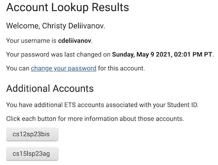
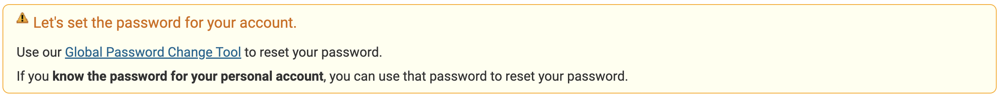
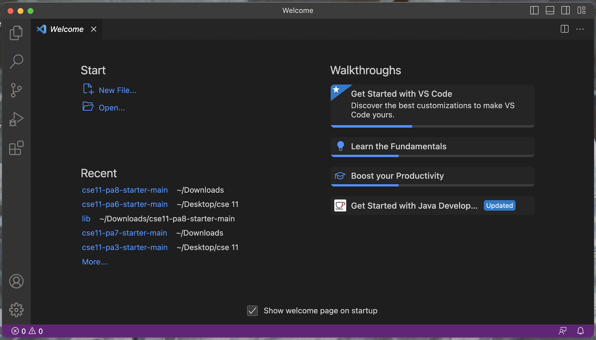
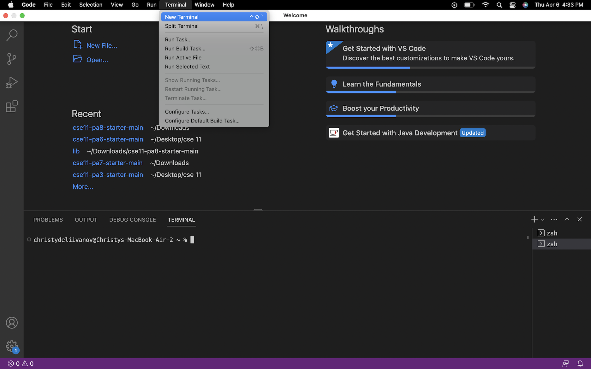
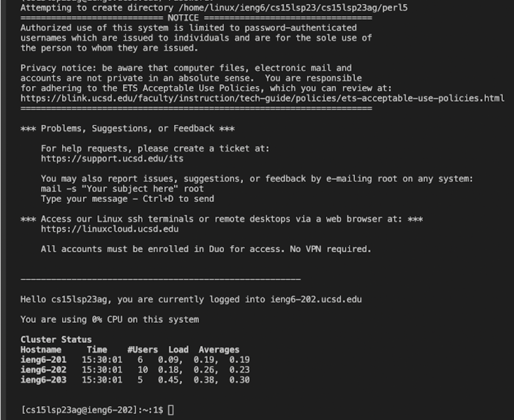
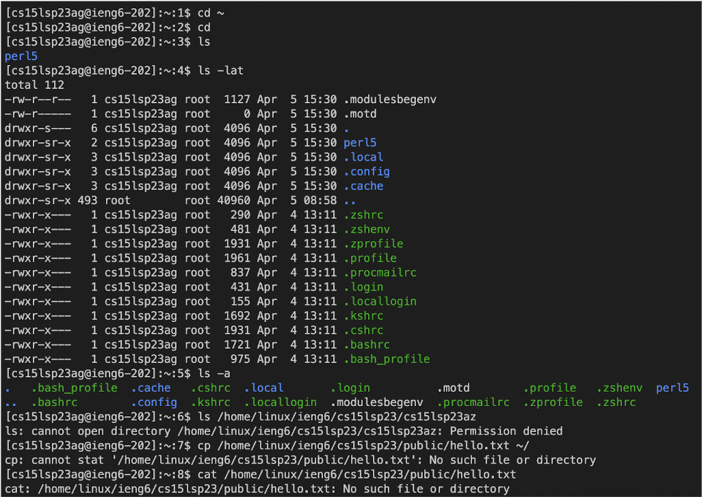

# Lab Report 1: Remote Access and FileSystem

In this report, we will review the steps needed to log into a course specific account on `ieng6`.

## Part 1 - Resetting Password
If you have not already or if you have forgotten it, you will need to reset your password. 

First find your course specific account here: [https://sdacs.ucsd.edu/~icc/index.php](https://sdacs.ucsd.edu/~icc/index.php)

Look up your account using your general UCSD username and PID. When you log in, you should be welcomed with your name. Under "Additional Accounts" you should see a button that starts with `cse15l`. It is the second button seen in the image. Click that button. 

Take note of your username. In the yellow box, follow the link to set your password. Make sure you paste the username you just copied as the account you would like to reset. You are setting the password for your course-linked account, not your Active Directory. 

Follow the directions to set the password. You will get an email and from there you will enter a new password. Take note of your password. 

## Part 2 - VS Code
I already had VS Code installed on my computer. If one does not have VS Code already installed, one must follow this link and follow the instructions on the website to install it. 

[https://code.visualstudio.com/](https://code.visualstudio.com/)

When launching VS Code, you should be welcomed with a home page similar to this. 

## Part 3 - Remotely Connecting
Now we are going to remotely connect using the course specific account we were mentioning earlier in Part 1. We will use VS Code to connect to a remote computer using the internet. 

We are going to use `ssh`. First, open a terminal in VS Code. Do this by finding the Terminal menu at the top of the screen and selecting New Terminal or using the Control + Shift + ` shortcut. 

Now we are going to insert this command into the terminal, with the x spaces replaced with the letters found in the username you took note of earlier. 

`ssh cs15lsp23xx@ieng6.ucsd.edu`

From there, you may be prompted asking if you would like to connect. Type yes and press enter. Then type in your password (it won't show) and press enter. 

![Image}(Screen Shot 2023-04-06 at 4.44.29 PM.png)

Once you have entered your password, you should be connected to the remote computer. Your terminal should look like this. 

## Part 4 - Trying Some Commands
Now that we've connected to the remote computer, we can try running some commands. Here you can see commands such as `cd ~`, `cd`, `ls`, `ls -lat`, and `ls -a`. You can also see that when we tried `ls /home/linux/ieng6/cs15lsp23/cs15lsp23az`, where az was another teammate's username, we recieved a permession denied message. `cp /home/linux/ieng6/cs15lsp23/public/hello.txt ~/` and `cat /home/linux/ieng6/cs15lsp23/public/hello.txt` also recieved errors.  

You can also try other commands such as `pwd`, `mkdir`, and `cp`.

When you are done using the remote computer, log out by using Ctrl + D or using the command `exit` in the terminal.
