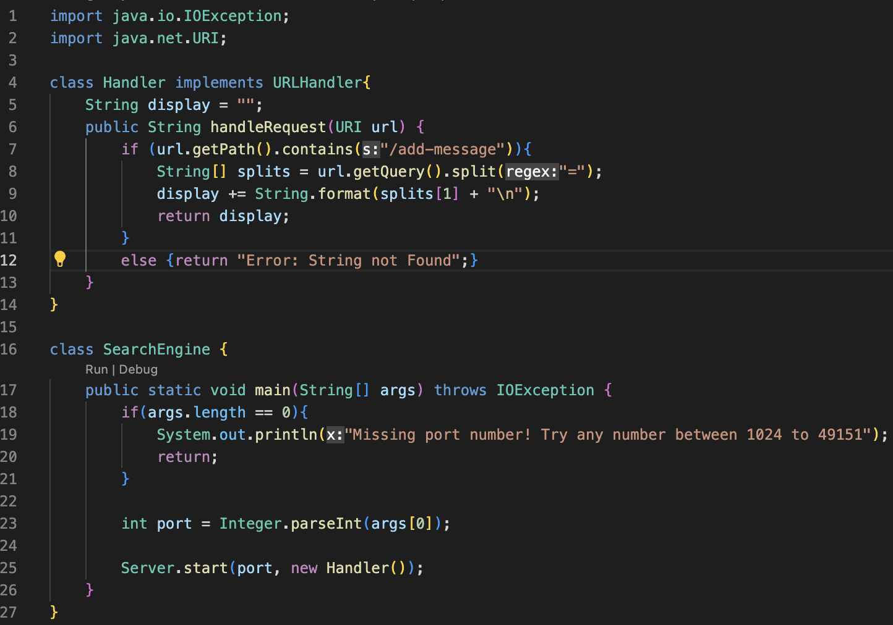

# Lab Report 2: Servers and Bugs

In this report, we will go through the StringServer web server and bugs in the lab 3. 

## Part 1 - StringServer

Here is the code for StringServer.



Here we see the result of using /add-message.


The method in my code that is ultimately called to create this result is the handleRequest method. Both screenshots use the handleRequest method. This method uses the url as an argument. First the url is checked to see if /add-message is contained. Then if it is, the url is split by the '=' to seperate what will be added to the display. The String array 'splits' stores the split url, with the index 1 holding what the message to be displayed is. The 'display' variable is used to store what is added to the display so the /add-message command can be used over and over. 

The 'display' variable is changed everytime add-message is used. This variable is outside the function as it stores what is being added with each new url input. Everytime a url with the /add-message command is used, that is added to 'display' along with \n to start a new line. The 'splits' array is also being reassigned with each new url with the /add-message command to store the new message. 

## Part 2 - Bug in Lab 3

Original Code
```
// Returns a *new* array with all the elements of the input array in reversed
  // order
  static int[] reversed(int[] arr) {
    int[] newArray = new int[arr.length];
    for(int i = 0; i < arr.length; i += 1) {
      arr[i] = newArray[arr.length - i - 1];
    }
    return arr;
  }
```

Failure-inducing input 
```
@Test
  public void testRMultipleInputs() {
    int[] input1 = {3, 4};
    assertArrayEquals(new int[]{4, 3}, ArrayExamples.reversed(input1));
  }
```


