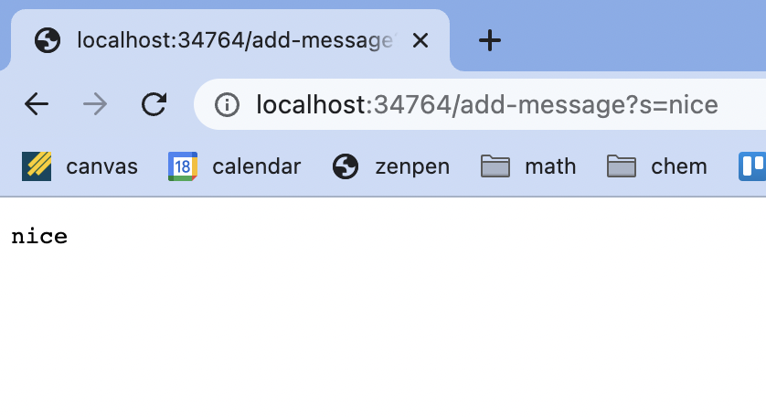
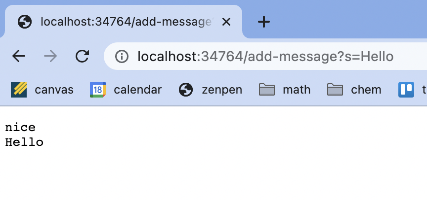

# Lab Report 2: Servers and Bugs

In this report, we will go through the StringServer web server and bugs in the lab 3. 

## Part 1 - StringServer

Here is the code for StringServer.

Here we see the result of using /add-message.

The method in my code that is ultimately called to create this result is the handleRequest method. Both screenshots use the handleRequest method. This method uses the url as an argument. First the url is checked to see if /add-message is contained. Then if it is, the url is split by the '=' to seperate what will be added to the display. 

