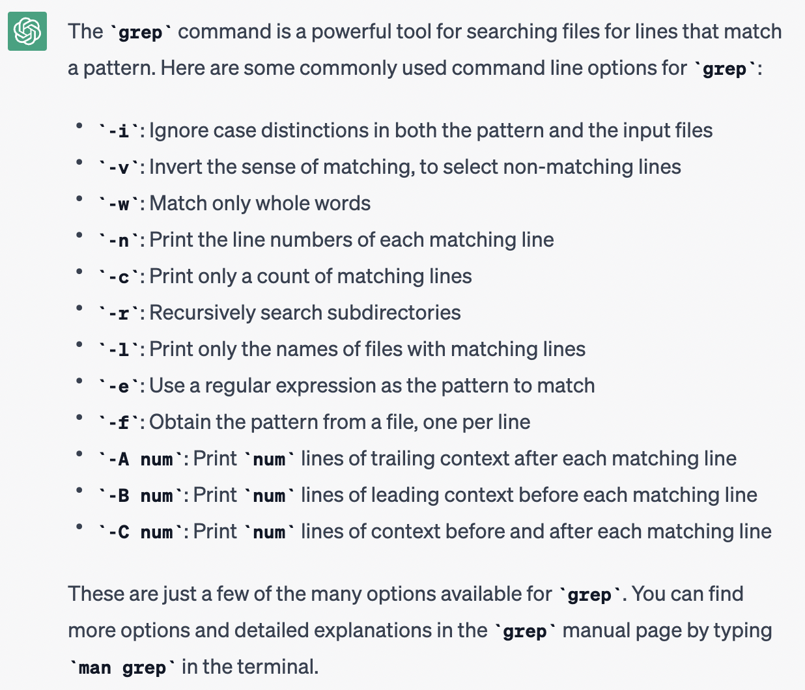

# Lab Report 3: Researching Commands

In this report, we will research the grep command further

## Grep Command
When I asked ChatGBT `What are some grep command line options?` it returned



## -w Command
The -w command makes it so that only whole words are matched. 
```
christydeliivanov@christys-air-2 911report % grep -w "we" preface.txt
the United States. The nation was unprepared. How did this happen, and how can we
                areas determined relevant by the Commission. In pursuing our mandate, we have
                From the outset, we have been committed to share as much of our investigation as we
                can with the American people. To that end, we held 19 days of hearings and took
            At the outset of our work, we said we were looking backward in order to look forward.
                positive-an America that is safer, stronger, and wiser. That September day, we came
            As we complete our final report, we want to begin by thanking our fellow
                of several previous Commissions, and we thank the Congressional Joint Inquiry, whose
                the importance of the work we have undertaken.
            We want to note what we have done, and not done. We have endeavored to provide the
                most complete account we can of the events of September 11, what happened and why.
                This final report is only a summary of what we have done, citing only a fraction of
                the sources we have consulted. But in an event of this scale, touching so many
                issues and organizations, we are conscious of our limits. We have not interviewed
                number of them. We decided consciously to focus on recommendations we believe to be
                pause, reflect, and sometimes change our minds as we studied these problems and
``` 
We specify that the grep command is of the -w type and specify that I am searching for the word 'we' in the file preface.txt.
This command will only return lines with the word 'we' inside the preface.txt file and will not include any words that may contain we. 

```
christydeliivanov@christys-air-2 technical % grep -w "glioblastoma" biomed/*.txt
biomed/1471-2199-2-2.txt:        such as glioblastoma and carcinomas of the prostate,
biomed/1471-2199-3-11.txt:        PTEN gene into anchorage-independent human glioblastoma
biomed/1471-2199-3-11.txt:          U87 glioblastoma tumor cell line has been described [ 57
biomed/1471-2407-2-15.txt:        glioblastoma, melanoma, ovarian carcinoma, prostatic
biomed/1471-2407-2-15.txt:          Receptor inhibits growth of U87 glioblastoma cells
biomed/1471-2407-2-8.txt:        promoter activity in human glioblastoma and transformed
biomed/1476-4598-2-1.txt:          including glioma and glioblastoma, pancreatic and colonic
biomed/gb-2002-3-9-research0051.txt:          cell cultures [ 32]. In glioblastoma cells (and
biomed/gb-2003-4-7-r46.txt:        from human brain glioblastoma. Our study examined the
biomed/gb-2003-4-7-r46.txt:          U118 brain glioblastoma cell line were cultured at 37°C
```
We specify that the grep command is of the -w type and specify that I am searching for the word "glioblastoma" in files any of the biomed. Here it returns the file and line the word is found in.  

