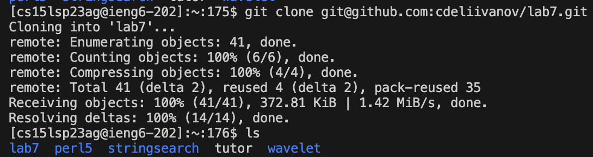
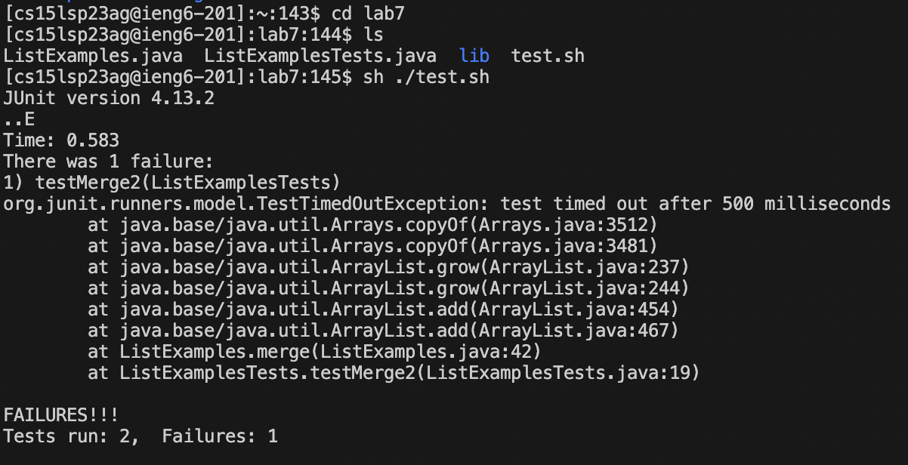
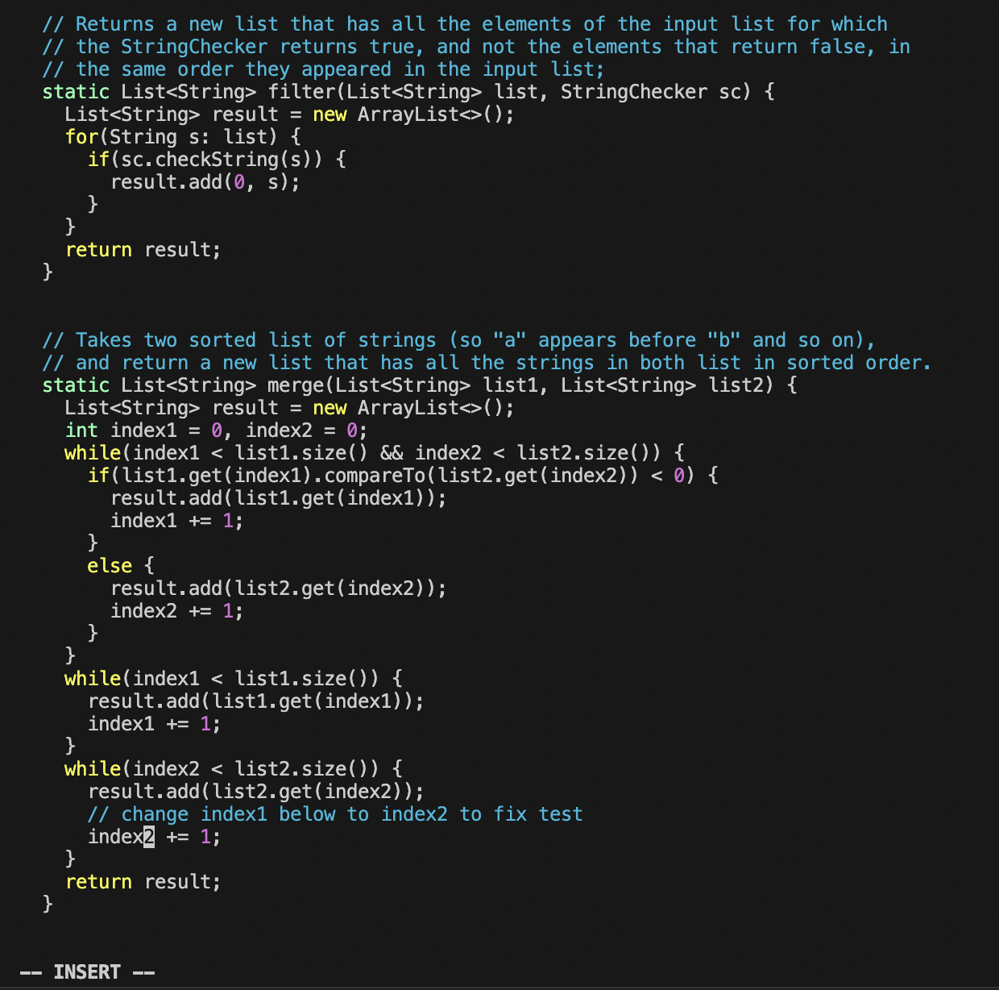
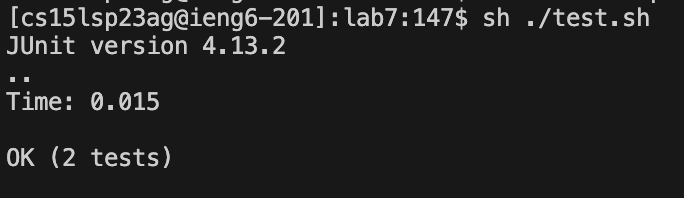
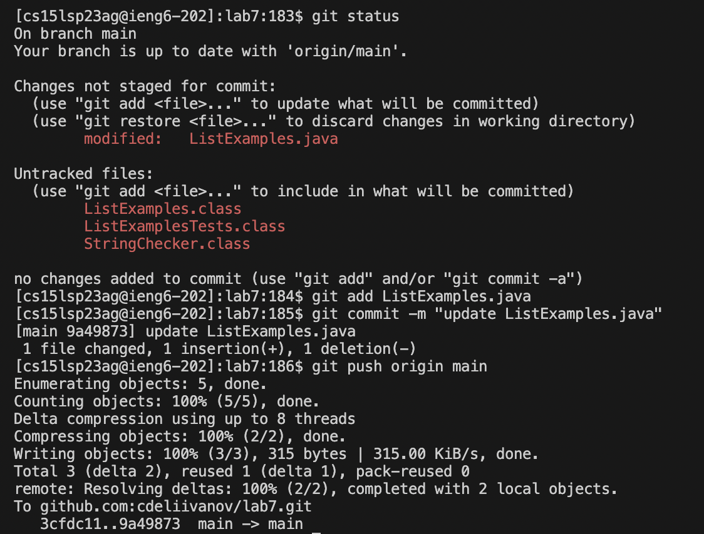

# Lab Report 4: Command Line Tasks
In this report we will be going through command line tasks.

## Step 4
```ssh cs15lsp23ag@ieng6.ucsd.edu <Enter>```
  

First I used ssh to log into my ieng6 account.  

## Step 5
```
git clone git@github.com:cdeliivanov/lab7.git <Enter>
ls <Enter>
```
  
  
Then I cloned the lab7 repository. Make sure it is the SSH link to ensure you can push changes afterwards. I used ls to double check that it was there.  
  
## Step 6
```
cd lab7 <Enter>
sh ./test.sh <Enter>
```
  

Here I cd to access the files inside lab7. Then I run the tests to see that they fail.
  
## Step 7
```
vim ListExamples.java <Enter>
?change <Enter> j l l
x i 2
ctrl + c
:wq <enter>
```
  

Here I used the vim command to go into the ListExamples.java file. Then I used ?change to search for 'change' as a keyword and used j l l as my arrow keys to move over to the 1 in 'index1'. Then I used x to delete the 1 and 'i' to go into insert mode and typed '2' to make it index2. Then I did ctrl+c to exit insert mode and ':wq' to exit vim and save my changes. 
  
## Step 8
```<up>, <up>, <enter>```
  

I used my up buttons to pull down the sh ./test.sh command from earlier.
  
## Step 9
```
git status
git add ListExamples.java
git commit -m "update ListExamples.java"
git push origin main
```


Here I used git status to check what I was saving. Then I added ListExamples.java and used commit -m with a commit note to commit the changes. Then I did push origin main to push the changes. 
