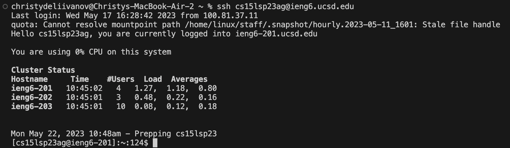
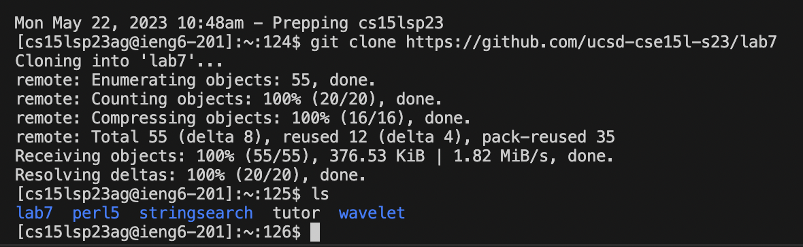

# Lab Report 4: Command Line Tasks
In this report we will be going through command line tasks.

## Step 4
ssh cs15lsp23ag@ieng6.ucsd.edu <Enter>
  

  
## Step 5
git clone https://github.com/ucsd-cse15l-s23/lab7 <Enter>
ls <Enter>
  
  
  
## Step 6
cd lab7 <Enter>
sh ./test.sh <Enter>
  
## Step 7
vim ListExamples.java <Enter>
?change <Enter> j l l
x i 2
ctrl + c
:wq <enter>
  
## Step 8
<up>, <up>, <enter>
  
## Step 9

