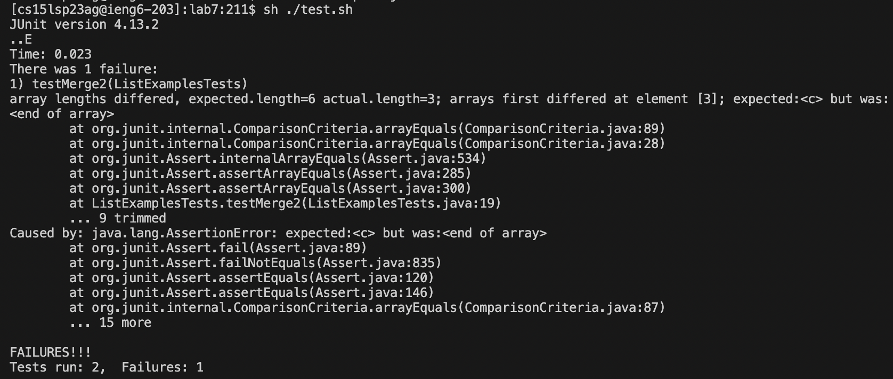
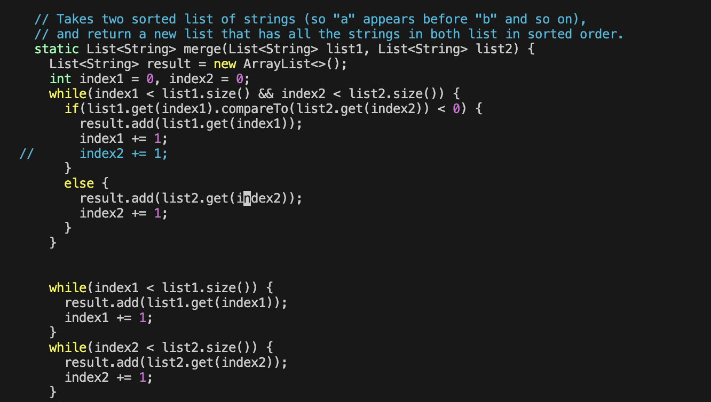
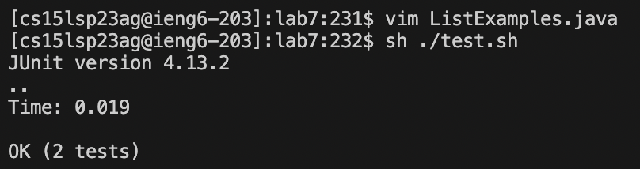

# Lab Report 5
In this report we will go through an example debugging senario. 

## Part 1: Debugging Senario
**Edstem Post**

 

I am on VSCode in the lab7 repository. The symptom is that when I run the file of tests ListExamplesTests.java I get these results. 
There are lots of different errors cited so I am not sure what happened. The failed test takes a list of ["x", "y"] and ["a", "b"] to get ["a", "b", "x", "y"].

**Ta Response**

When we look at the error message at the top of the code we see that something is off with the array lengths. The expected length is a lot shorter so you likely are adding too much length somewhere in your method.  

**Fix**

 

The bug was found to be an extra addition to the index2 count. By blocking off different lines adding to the index counts, we will find that blocking off this line results in both the tests passing. 

**Overview**

The bug was in the ListExamples.java file in the lab7 repository. ListExamplesTests.java is a file filled with tests for ListExamples. 
ListExamples.java had a method that merges two string lists together in sorted order. There was an extra line `index2 += 1` inside the if statement that was making the array too long. The line we ran to see the bug was `sh ./test.sh` which ran the test file and returned a failed test and error message. To fix the bug we commented out that line and the tests both passed. That line is unnecessary so we can delete it. 

## Part 2: Reflection
Something cool that I learned this quarter is that you can edit files within the terminal. The vimtutor lab was probably the most interesting to me because it was cool to see how many different shortcuts there were for specific functions. Also, how you can add a number in front of a command to do it multiple times. Learning about all the different functions makes it feel like vim is very complex and masterfully crafted to serve any function you could possibly think of. 
